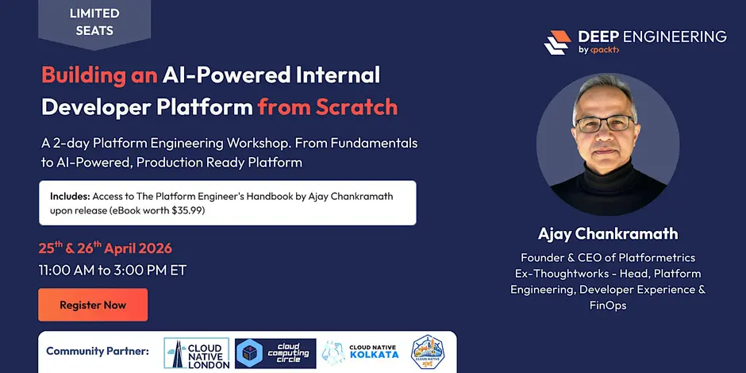

# [Workshop][Ajay Chankramath] Building an AI-Powered Internal Developer Platform from Scratch [ENG, 2026]



<br/>

**Original repo:**  
https://github.com/achankra/peh-course


<br/>

A hands-on, 2-day workshop by [Ajay Chankramath], author of *The Platform Engineer's Handbook* (Packt, 2026).


### Companion Resources

This course is based on *The Platform Engineer's Handbook*. The book covers the full breadth of platform engineering across 14 chapters, including tools like ArgoCD, Argo Rollouts, OpenCost, and more that go beyond what we can cover in two days. The course distills the book's core concepts into a hands-on, buildable platform you can take home.

- **Book Companion Site:** [peh-packt.platformetrics.com](https://peh-packt.platformetrics.com/)
- **Book GitHub Repo:** [github.com/achankra/peh](https://github.com/achankra/peh) — full code samples for all 14 chapters
- **Course GitHub Repo:** [github.com/achankra/peh-course](https://github.com/achankra/peh-course) — this repo (workshop code only)

---

## What This Course Is About

Most platform engineering content stops at theory. This workshop starts from an empty terminal and walks you through every layer of an Internal Developer Platform — from cluster provisioning and infrastructure-as-code through developer portals, observability, chaos engineering, and AI-powered operations. Over two days (4 hours each, 9 sessions), you'll build and run each component hands-on, understand how they connect, and leave with working code you can extend at your own pace.

No cloud accounts required. No vendor lock-in. Everything runs locally on Kubernetes (Kind), uses open-source tools, and is designed so you can take what you build straight back to your team. For the complete platform engineering journey across all 14 chapters, see [*The Platform Engineer's Handbook*](https://peh-packt.platformetrics.com/).

### What You'll Walk Away With

- A Kind cluster configured with team namespaces, RBAC roles, and resource quotas — the multi-tenant foundation of any IDP
- Crossplane XRDs and Compositions that turn database provisioning into a 10-line developer claim
- Backstage software templates, service catalog configuration, and a project bootstrapper that scaffolds production-ready services
- An OpenTelemetry Collector pipeline with Prometheus metrics, Jaeger tracing, Loki logging, and SLO definitions using Sloth
- Canary and blue-green deployment manifests with an automated rollback controller
- Chaos Mesh experiments (network delay, pod kill, pod failure) that test resilience before users find the gaps
- AI-powered automation scripts: RAG doc search (runs locally, no API key), multi-agent incident response, alert correlation, and governance alerts
- A personal 30/60/90-day platform adoption roadmap based on your maturity assessment

> **Course vs. Book:** This workshop introduces each layer of the platform with working code and hands-on exercises. *The Platform Engineer's Handbook* goes deeper — covering production GitOps with ArgoCD, advanced progressive delivery with Argo Rollouts, cost management with OpenCost, and more across 14 chapters. The course is the starting point; the book is the complete reference.

### Who Should Attend

Platform Engineers, DevOps Engineers, SREs, Infrastructure Engineers, Engineering Managers, AI/ML Engineers building internal tooling, and anyone responsible for developer productivity.

---

## Prerequisites

Minimal by design. You need a laptop, a terminal, and the tools below.

### Hardware

- 8 GB RAM minimum (16 GB recommended)
- 20 GB free disk space
- Linux

---

## Tech Stack

The course standardizes on one tool per job to keep setup simple and eliminate "which tool should I use?" decisions. Everything below is open source and runs locally.

| Layer | Tool | Purpose |
|---|---|---|
| **Container Runtime** | Docker Desktop (or Colima / OrbStack) | Runs containers locally |
| **Kubernetes** | Kind (Kubernetes in Docker) | Local multi-node clusters |
| **Package Manager** | Helm | Installs Crossplane, Prometheus, Chaos Mesh into the cluster |
| **IaC / Provisioning** | Pulumi (Python SDK) | Cluster and resource provisioning |
| **Resource Abstraction** | Crossplane | Self-service XRDs, Compositions, Claims |
| **Policy Engine** | OPA / Conftest / Gatekeeper | Policy-as-Code, shift-left validation |
| **Git Hooks** | pre-commit | Shift-left validation on every commit |
| **Developer Portal** | Backstage | Service catalog, software templates, docs |
| **CI/CD** | GitHub Actions | Reusable workflow pipelines |
| **Observability** | OpenTelemetry Collector | Unified telemetry collection |
| **Metrics** | Prometheus + Sloth | Metrics, SLO-driven alerting |
| **Tracing** | Jaeger | Distributed tracing |
| **Logging** | Loki | Log aggregation |
| **Autoscaling** | HPA / VPA | Horizontal and Vertical Pod Autoscaling |
| **Chaos Engineering** | Chaos Mesh | Fault injection experiments |
| **Progressive Delivery** | Canary / Blue-Green | Built-in deployment manifests with rollback controller |
| **Backup & Recovery** | Velero | Cluster backup and restore |
| **AI / LLM** | Anthropic Claude (optional) | RAG, multi-agent incident response |
| **AI (Local / No API Key)** | TF-IDF (scikit-learn) | Local doc search, alert correlation |
| **Web Framework** | Flask | Self-service onboarding API |
| **Language** | Python 3 | All scripts and automation |

> **Note on Developer Portal:** The workshop uses Backstage as the reference portal. For evaluating alternatives (Port, Cortex, Harness IDP, OpsLevel, and more), see [Portal IQ](https://portal-iq.platformetrics.com/).

> **Note on AI features:** Every AI demo has a local-only fallback (TF-IDF, heuristics) that runs without any API key. Claude integration is optional for those who want to explore LLM-powered capabilities.

> **Looking for ArgoCD, Argo Rollouts, OpenCost, or other tools?** The book covers a broader set of tools across 14 chapters. See the [book repo](https://github.com/achankra/peh) for the full stack. This course focuses on the subset you can build and run in two days.

---

### Software — Install Before Day 1

| Tool | Version | Install |
|---|---|---|
| **Docker Desktop** (or alternative above) | Latest | [docker.com/get-started](https://www.docker.com/get-started/) |
| **Kind** | v0.20+ | `brew install kind` or [kind.sigs.k8s.io](https://kind.sigs.k8s.io/docs/user/quick-start/#installation) |
| **kubectl** | v1.28+ | `brew install kubectl` or [kubernetes.io/docs/tasks/tools](https://kubernetes.io/docs/tasks/tools/) |
| **Helm** | v3.12+ | `brew install helm` or [helm.sh/docs/intro/install](https://helm.sh/docs/intro/install/) |
| **Python 3** | 3.10+ | `brew install python3` or [python.org](https://www.python.org/downloads/) |
| **pip3** | Latest | Comes with Python 3 |
| **Node.js** | v18+ | `brew install node` (for Backstage) |
| **Git** | Latest | `brew install git` |
| **Pulumi** | Latest | `brew install pulumi` or [pulumi.com/docs/install](https://www.pulumi.com/docs/install/) |
| **conftest** | Latest | `brew install conftest` or [conftest.dev](https://www.conftest.dev/install/) |
| **pre-commit** | Latest | `pip3 install pre-commit --break-system-packages` or [pre-commit.com](https://pre-commit.com/#install) |

### Python Packages

```bash
$ pip install pulumi pulumi-kubernetes scikit-learn pyyaml requests flask --break-system-packages
```

### Optional: run the setup in an isolated devcontainer
This is optional and can be used, but does not have to. For example `vscode` supports it via extension. See the docs [here](https://code.visualstudio.com/docs/devcontainers/containers) for more details and how to start it.

In the container there are some opinionated tools for kubernetes and ai installed, such as
- [k9s](https://github.com/derailed/k9s), [kx](https://github.com/onatm/kx) and `kn`
- [claude-code](https://code.claude.com/docs/en/overview) which you can login within the container via browser login

To open a shell in the container you can
1. either open it directly in `vscode` via a terminal
2. or exec directly on the shell via `docker exec -w "/workspaces/peh-course" -it $(docker ps --filter name=peh-course -q) zsh`

A known issues for `orbstack` is that by default the kubeconfig from a kind cluster points to 127.0.0.1:34747 — that's the host's port-forward to the Kind API server. Inside the devcontainer, 127.0.0.1 is the container's loopback, not the host's, so the connection refuses.

The fix is the following, e.g. for Session2
```bash
# Create the cluster first
kind create cluster --name workshop
# From inside the devcontainer (docker-outside-of-docker gives you the host daemon:                                                                                                      
docker network connect kind peh-course                                                                                                                                                    
kind get kubeconfig --name workshop --internal > /root/.kube/config
kubectl cluster-info 

# verify it e.g. via
pwd
/workspaces/peh-course/Session2/demo
# then execute the runner script, which should terminate succesfully
../../runners/run-session2-demo.sh 
```

### Quick Validation

Run this after installation to confirm everything works (also in devcontainer):

```bash
docker --version
kind --version
kubectl version --client
helm version --short
python3 --version
pulumi version
conftest --version
```

---

## Repository Structure

Every session has two folders: **demo** (what we build together live) and **takehome** (exercises to reinforce learning after the session). Each folder has its own README with step-by-step instructions.

```
Code/
├── Session1/           # Platform Engineering Fundamentals
│   ├── demo/           # Platform maturity assessment
│   └── takehome/       # Deep platform analysis & baseline KPIs
├── Session2/           # Infrastructure & Control Plane
│   ├── demo/           # Kind cluster, namespaces, RBAC, Pulumi
│   └── takehome/       # Build your own control plane
├── Session3/           # IaC, Policy & CI/CD
│   ├── demo/           # Crossplane XRDs, conftest, AI templates
│   └── takehome/       # Pipeline authoring, Rego policies
├── Session4/           # Day 1 Integration & Synthesis
│   ├── demo/           # End-to-end verification test suites
│   └── takehome/       # Consolidation, prep for Day 2
├── Session5/           # Developer Experience & Self-Service
│   ├── demo/           # Backstage, project bootstrapper, RAG doc search
│   └── takehome/       # Onboarding pipeline, starter kit templates
├── Session6/           # Observability, SLOs & Cost Management
│   ├── demo/           # OTel Collector, Sloth SLOs, AI alert correlation
│   └── takehome/       # Full observability stack, HPA/VPA, cost monitoring
├── Session7/           # Production Readiness, Security & Resilience
│   ├── demo/           # Chaos Mesh, canary deployments, AI runbook automation
│   └── takehome/       # Velero backups, blue-green, security scanning
├── Session8/           # AI-Augmented Platforms
│   ├── demo/           # RAG doc search, multi-agent incident response, AI governance
│   └── takehome/       # Full AI platform stack, guardrails, agent testing
└── Session9/           # Team Topologies, Synthesis & Next Steps
    ├── demo/           # Team topology generator, platform KPIs, AI impact metrics
    └── takehome/       # Team topology mapping, 30/60/90-day roadmap, maturity re-assessment
```

---

## Course Agenda

### Day 1 — Foundations (4 hours)

| Session | Title | Focus |
|---|---|---|
| [Session 1](Session1/) | **Platform Engineering Fundamentals** | Why platforms, maturity model, design principles, Platform as Product |
| [Session 2](Session2/) | **Infrastructure & Control Plane** | Kind cluster, Pulumi IaC, namespace isolation, RBAC, resource quotas |
| [Session 3](Session3/) | **IaC, Policy & CI/CD** | Crossplane self-service, OPA/Conftest policies, AI-generated templates, GitOps pipelines |
| [Session 4](Session4/) | **Day 1 Integration & Synthesis** | End-to-end verification, cross-layer testing, consolidation |

### Day 2 — Experience, Operations & AI (4 hours)

| Session | Title | Focus |
|---|---|---|
| [Session 5](Session5/) | **Developer Experience & Self-Service** | Backstage portal, service catalog, golden paths, AI-powered doc search (RAG) |
| [Session 6](Session6/) | **Observability, SLOs & Cost** | OpenTelemetry, Prometheus, Sloth SLOs, cost analysis, AI alert correlation |
| [Session 7](Session7/) | **Production Readiness & Resilience** | Chaos Mesh, canary/blue-green, Velero backups, AI runbook automation |
| [Session 8](Session8/) | **AI-Augmented Platforms** | RAG doc search, multi-agent incident response, AI governance, agent observability, MCP |
| [Session 9](Session9/) | **Team Topologies, Synthesis & Next Steps** | Conway's Law, team topology mapping, KPI measurement, 30/60/90-day roadmap |

---

## Getting Started

### Step 1: Create Your Cluster (Before Session 2)

Session 1 is mostly conceptual — you just need Python 3. From Session 2 onward, everything runs on Kind:

```bash
$ kind create cluster --name workshop
$ kubectl cluster-info --context kind-workshop
```

### Step 2: Install Platform Services (Session 2)

```bash
$ cd Session2/demo

# Create isolated team namespaces with resource quotas, network policies, and service accounts
$ python namespace-provisioner.py --namespace team-alpha --env dev --team alpha
$ python namespace-provisioner.py --namespace team-beta --env dev --team beta

# Apply platform admin RBAC: ClusterRoles, ServiceAccounts, and bindings
$ kubectl apply -f rbac-platform-admin.yaml
```

### Step 3: Add Crossplane and Policies (Session 3)

```bash
$ cd Session3/demo

# Install Crossplane providers, define the developer-facing API (XRD), and map it to resources (Composition)
$ kubectl apply -f crossplane-providers.yaml
$ kubectl apply -f xrd-postgresql.yaml
$ kubectl apply -f composition-postgresql.yaml

# Run policy checks against intentionally bad manifests — shift-left validation in action
$ conftest test conftest-tests/test-manifests.yaml -p conftest-tests/
```

### Step 4: Verify Everything Works (Session 4)

```bash
$ cd Session4/demo

# Validate cluster health: nodes Ready, system pods running, team namespaces exist, quotas applied
$ python test-cluster-health.py

# Verify infrastructure: namespace isolation, RBAC roles and bindings, Crossplane readiness
$ python test-infrastructure.py

# Run policy checks: conftest catches missing labels, privileged containers, untrusted registries
$ python test-policies.py
```

If all three pass, your Day 1 foundation is solid. If any fail, the output tells you exactly which Session 2 or 3 step was missed.

### Step 5: Developer Experience and Self-Service (Session 5)

```bash
$ cd Session5/demo

# Scaffold a complete service: repo structure, Dockerfile, CI/CD, k8s manifests, catalog entry
$ python project-bootstrapper.py bootstrap platform demo-api python

# AI-powered doc search: index platform docs and answer queries locally with TF-IDF
$ python rag-platform-docs.py
```

### Step 6: Observability Stack (Session 6)

```bash
$ cd Session6/demo

# Deploy the OTel Collector as the single entry point for all telemetry
$ kubectl apply -f otel-collector-deployment.yaml

# AI alert correlation: group noisy alerts into root-cause incidents
$ python alert-correlator.py
```

### Step 7: Chaos and Resilience (Session 7)

```bash
$ cd Session7/demo

# Inject 100ms network latency into api-service pods via Chaos Mesh
$ kubectl apply -f chaos-network-delay.yaml

# Orchestrate the chaos experiment with safety controls and recovery monitoring
$ python chaos-runner.py

# Convert a markdown runbook into executable steps with safety gates
$ python runbook-automator.py
```

### Step 8: AI Platform Capabilities (Session 8)

```bash
$ cd Session8/demo

# RAG doc search: answer natural language queries against platform docs (no API key)
$ python rag-platform-docs.py

# Multi-agent incident response: Triage → Diagnosis → Remediation with human-in-the-loop
$ python incident-agent.py

# AI agent observability: Prometheus metrics for latency, confidence, override rates
$ python ai-agent-observability.py
```

### Step 9: Team Topologies, Measure and Plan (Session 9)

```bash
$ cd Session9/demo

# Map your org into Team Topologies types and visualize interaction modes
$ python team-topology-generator.py

# Collect DORA metrics: deployment frequency, lead time, MTTR, change failure rate
$ python platform-kpi-collector.py

# Quantify AI impact in business terms: hours saved, incidents resolved faster
$ python measure-ai-impact.py
```

---

## Session-by-Session Installation

If you prefer to install tools incrementally as needed:

### Session 1 — No extra tools needed
```bash
$ python3 --version   # Confirm Python 3.10+
```

### Session 2 — Kubernetes + Pulumi
```bash
$ kind create cluster --name workshop
$ pip install pulumi pulumi-kubernetes --break-system-packages
```

### Session 3 — Crossplane + Conftest
```bash
$ helm repo add crossplane-stable https://charts.crossplane.io/stable
$ helm install crossplane crossplane-stable/crossplane --namespace crossplane-system --create-namespace
# conftest should already be installed from prerequisites
```

### Session 4 — No extra tools (verification only)
```bash
$ python Session4/demo/test-cluster-health.py
$ python Session4/demo/test-infrastructure.py
$ python Session4/demo/test-policies.py
```

### Session 5 — Backstage + scikit-learn
```bash
$ pip install scikit-learn --break-system-packages
# Backstage (optional local setup): npx @backstage/create-app@latest
```

### Session 6 — OTel + Prometheus + Sloth
```bash
$ helm repo add prometheus-community https://prometheus-community.github.io/helm-charts
$ helm install prometheus prometheus-community/kube-prometheus-stack --namespace monitoring --create-namespace
$ pip install pyyaml requests --break-system-packages
```

### Session 7 — Chaos Mesh + Velero
```bash
$ helm repo add chaos-mesh https://charts.chaos-mesh.org
$ helm install chaos-mesh chaos-mesh/chaos-mesh --namespace chaos-mesh --create-namespace
# Velero: https://velero.io/docs/main/basic-install/
```

### Session 8 — AI Dependencies (Optional Claude API)
```bash
$ pip install scikit-learn pyyaml --break-system-packages
# Optional (for LLM features): export ANTHROPIC_API_KEY=your-key-here
```

### Session 9 — No extra tools
```bash
# Uses tools already installed. Just run the scripts.
```
